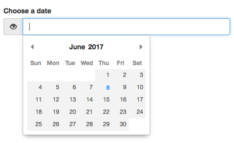

# Date picker plugin for [AbeCMS](https://github.com/abecms/abecms)

## Installation

Install plugin via AbeCMS CL:

```bash
abe install wonknu/abe-datepicker
```

## Usage

Add datepicker attribute to your abe tag type text

```bash
{{abe type='text' key='date' desc='Choose a date' datepicker='1'}}
```

## Result



## Format date

The default format date is DD-MM-YYYY

But custom date format can be use,  add a format attribute inside abe tag to change it

example :

```bash
{{abe type='text' key='date' desc='Choose a date' datepicker='1' format='D MMM YYYY'}}
```

This plugin use [Pikaday](https://github.com/dbushell/Pikaday), see [formatting section](https://github.com/dbushell/Pikaday#formatting) for more detailed info about supported date format
